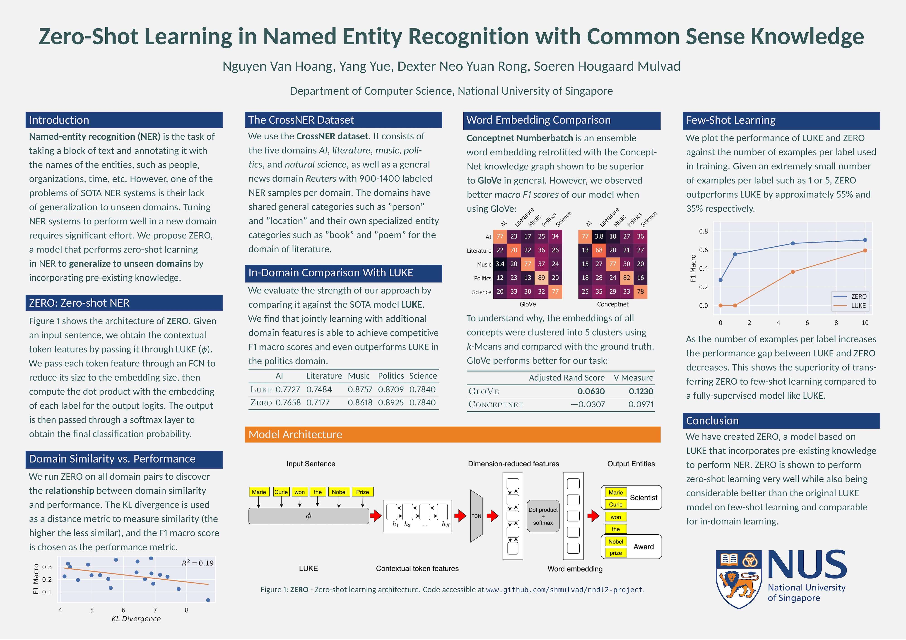

# Solving Zero-Shot Learning in Named Entity Recognition with Common Sense Knowledge

## Poster

[][poster]

## Attributions

In this project, we make extensive use of [LUKE] and the [CrossNER dataset].

## About

This is our project for the [CS5260 Neural Networks and Deep Learning II][CS5260] module at NUS.

[poster]: ./ner-poster.pdf
[LUKE]: https://arxiv.org/abs/2010.01057
[CrossNER dataset]: https://arxiv.org/abs/2012.04373
[CS5260]: https://nusmods.com/modules/CS5260/neural-networks-and-deep-learning-ii